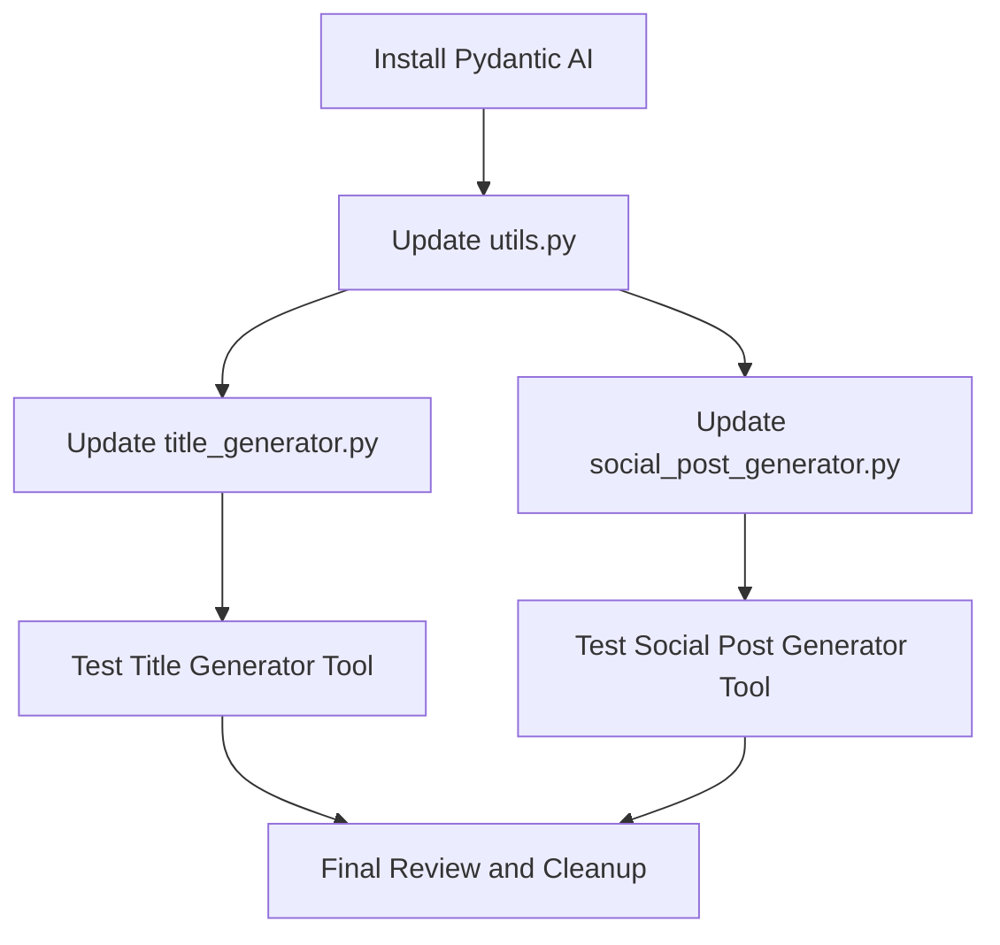

# Plan for Replacing LangChain with Pydantic AI in Bit Tools

Based on your requirements, I'll create a detailed plan to replace the LangChain implementation with Pydantic AI while maintaining the same functionality. This will involve modifying several files to use Pydantic AI's Agent and OpenAIModel classes instead of LangChain's components.

## Overview of Changes



## Detailed Steps

### 1. Install Pydantic AI

First, we need to add Pydantic AI to the project dependencies:

```bash
pip install pydantic-ai
```

And update the `requirements.txt` file to include this dependency.

### 2. Update `utils.py`

Replace the LangChain-based `create_openrouter_llm` function with a new function that creates a Pydantic AI Agent using OpenRouter:

```python
# Current implementation
def create_openrouter_llm(model_name, api_key, base_url):
    """
    Create a LangChain LLM instance connected to OpenRouter.
    
    Args:
        model_name: The model to use (e.g., "openai/gpt-4o-mini")
        api_key: OpenRouter API key
        base_url: Base URL for OpenRouter API
        
    Returns:
        An initialized LLM instance
    """
    return ChatOpenAI(
        model=model_name,
        openai_api_key=api_key,
        openai_api_base=base_url,
        temperature=0.7,  # Adjust for more/less creative responses
    )
```

```python
# New implementation
from openai import AsyncOpenAI
from pydantic_ai import Agent
from pydantic_ai.models.openai import OpenAIModel

def create_pydantic_agent(model_name, api_key, base_url):
    """
    Create a Pydantic AI Agent connected to OpenRouter.
    
    Args:
        model_name: The model to use (e.g., "openai/gpt-4o-mini")
        api_key: OpenRouter API key
        base_url: Base URL for OpenRouter API
        
    Returns:
        An initialized Pydantic AI Agent
    """
    client = AsyncOpenAI(
        api_key=api_key,
        base_url=base_url,
    )
    
    model = OpenAIModel(model_name, openai_client=client, temperature=0.7)
    return Agent(model)
```

### 3. Update `title_generator.py`

Replace LangChain's PromptTemplate and chain execution with Pydantic AI's Agent:

```python
# Current implementation
def _generate_titles(self, topic, platform, style):
    # Set up the LLM
    llm = create_openrouter_llm(
        DEFAULT_MODEL,
        OPENROUTER_API_KEY,
        OPENROUTER_BASE_URL
    )
    
    # Create the prompt
    prompt = PromptTemplate(
        input_variables=["topic", "platform", "style"],
        template=title_prompt_template
    )
    
    # Use the newer RunnableSequence approach instead of LLMChain
    chain = prompt | llm
    
    # Run the chain
    result = chain.invoke({"topic": topic, "platform": platform, "style": style})
    
    # Process the result to get a list of titles
    titles_text = result.content.strip()
    
    # ... rest of the function
```

```python
# New implementation
async def _generate_titles(self, topic, platform, style):
    # Set up the Pydantic AI Agent
    agent = create_pydantic_agent(
        DEFAULT_MODEL,
        OPENROUTER_API_KEY,
        OPENROUTER_BASE_URL
    )
    
    # Format the prompt with the input variables
    formatted_prompt = title_prompt_template.format(
        topic=topic,
        platform=platform,
        style=style
    )
    
    # Run the agent
    result = await agent.arun(formatted_prompt)
    
    # Process the result to get a list of titles
    titles_text = result.strip()
    
    # ... rest of the function
```

We'll also need to update the `process` method to be async and handle the async call to `_generate_titles`.

### 4. Update `social_post_generator.py`

Similar to the title generator, replace LangChain with Pydantic AI:

```python
# Current implementation
def _generate_posts(self, topic, platform, tone):
    llm = create_openrouter_llm(
        DEFAULT_MODEL,
        OPENROUTER_API_KEY,
        OPENROUTER_BASE_URL
    )
    
    prompt = PromptTemplate(
        input_variables=["topic", "platform", "tone"],
        template=social_prompt_template
    )
    
    chain = prompt | llm
    result = chain.invoke({"topic": topic, "platform": platform, "tone": tone})
    
    # Process the result to get a list of posts
    posts_text = result.content.strip()
    
    # ... rest of the function
```

```python
# New implementation
async def _generate_posts(self, topic, platform, tone):
    agent = create_pydantic_agent(
        DEFAULT_MODEL,
        OPENROUTER_API_KEY,
        OPENROUTER_BASE_URL
    )
    
    formatted_prompt = social_prompt_template.format(
        topic=topic,
        platform=platform,
        tone=tone
    )
    
    result = await agent.arun(formatted_prompt)
    
    # Process the result to get a list of posts
    posts_text = result.strip()
    
    # ... rest of the function
```

### 5. Update Imports

Remove LangChain imports and add Pydantic AI imports in both tool files:

```python
# Remove these imports
from langchain.prompts import PromptTemplate
from langchain_openai import ChatOpenAI
from langchain.chains import LLMChain

# Add these imports
import asyncio
from pydantic_ai import Agent
```

### 6. Handle Async in FastHTML

Since Pydantic AI uses async functions, we need to ensure that the FastHTML route handlers can properly await these async functions. The `process` methods in both tool classes will need to be updated to be async, and the route handlers in `main.py` will need to properly await these async methods.

### 7. Testing

After implementing these changes, we should test both tools to ensure they still function correctly:

1. Test the Title Generator with various topics, platforms, and styles
2. Test the Social Post Generator with various topics, platforms, and tones
3. Verify that the results are similar to the previous implementation

## Potential Challenges and Solutions

1. **Async Compatibility**: Pydantic AI uses async functions, which might require changes to how the FastHTML application handles requests. We may need to ensure that the route handlers properly await the async tool methods.

2. **Response Format**: The response format from Pydantic AI might differ slightly from LangChain. We'll need to ensure that the result processing logic still works correctly.

3. **Error Handling**: We'll need to update the error handling to catch any Pydantic AI-specific exceptions.

4. **Dependencies**: We'll need to add Pydantic AI to the project dependencies and potentially remove unused LangChain dependencies.

## Conclusion

This plan outlines the steps needed to replace LangChain with Pydantic AI in the Bit Tools application while maintaining the same functionality. The key changes involve updating the utility functions to create Pydantic AI Agents instead of LangChain LLMs, and modifying the tool implementation to use these agents for generating content.